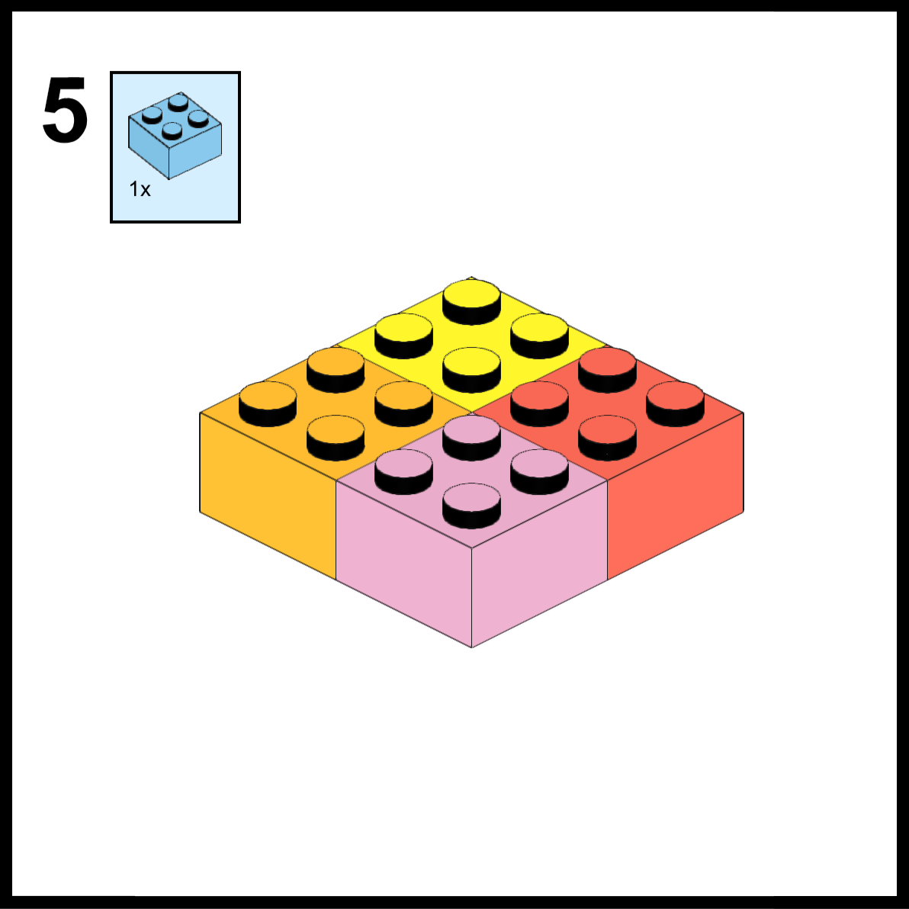
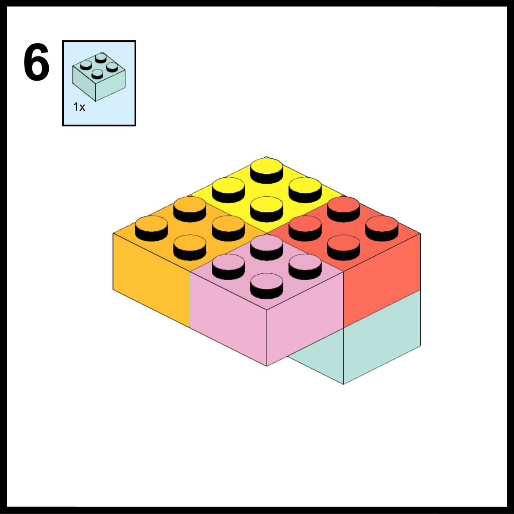
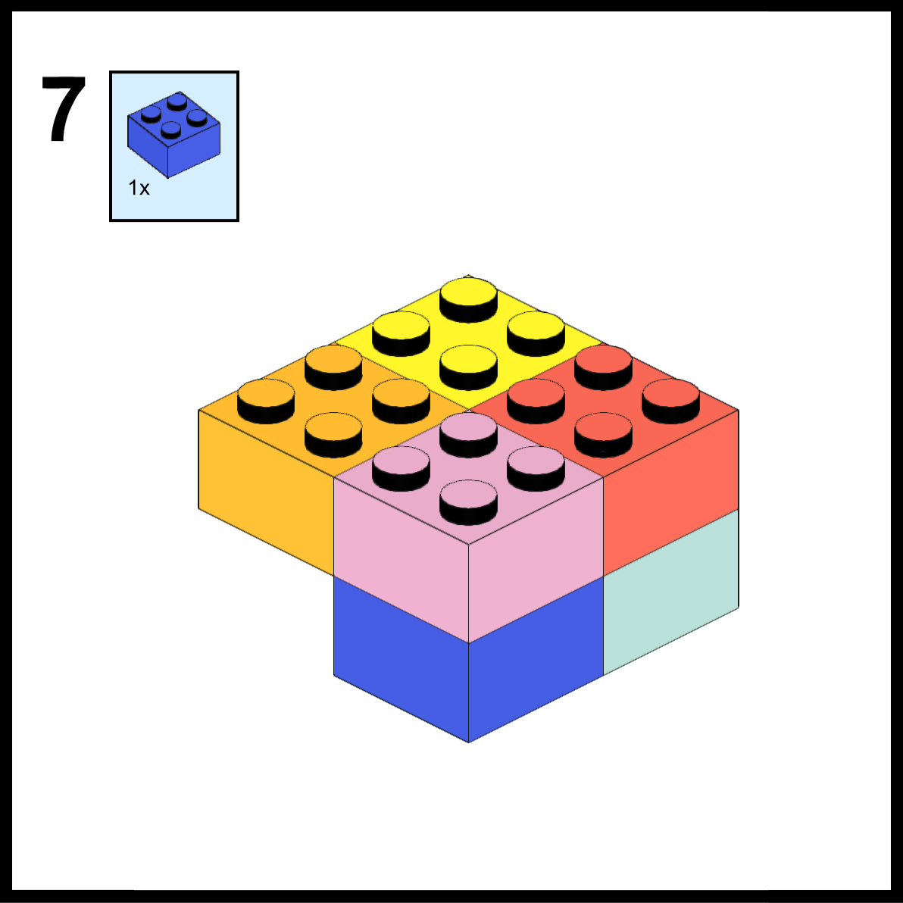

# Building Blocks with Bricks

To get started, make sure you have followed the setup instructions in the [Getting Started Guide](bb_gettingstarted.md#setup) and have created the brick folder path in your themes directory.

## Creating a Category
All blocks in Bricks are organized into categories. These categories are similar to the default categories in the Gutenberg editor:

1. Text
2. Media
3. Design
4. Widgets
5. Theme
6. Embeds

However, if these categories do not fit your needs, you can create your own custom category. To do so, create a new folder in your brick folder path with the desired name. For example, if you want to create a "Harry Potter" category, create a folder named `harrypotter` in `themesdir/templates/bricks/`.

In this folder, create a JSON file named `category.json` with the following content:

```json
{
  "slug": "harrypotter",
  "title": "Harry Potter",
  "icon": "editor-table"
}
```
The `slug`, `title`, and `icon` fields are required. If you wish to use a custom SVG as the icon, place the SVG file in the same folder as the category.json file.

This folder will now serve as the base for all blocks in the **Harry Potter** category.

# Building your first brick

Creating a brick involves setting up a specific directory structure and adding required files within it to create a functional Gutenberg block. The files typically include templates, styles, and scripts, which define the structure and functionality of the block.

Additionally, fields can be defined using ACF, providing a way to input custom data for the block.

With this setup, developers can easily create reusable and customizable blocks to extend the functionality of their WordPress site.
## Required Files for a Brick

- **template.php | template.vue**: contains the logic and template structure of your block.
- **scripts.js**: contains the JavaScript code for your block. (optional)
- **acf.json**: contains the advanced custom fields json that should be available in the backend. (optional)
- **style.css | styles.scss**: contains the styles for your block. (optional)
- Alternatively, you can use style.scss if you prefer.

## Recommended Naming Conventions
For ease of parsing and access, it's recommended to keep template file names consistent across your blocks.

The same goes for styling and javascript files, as all will be loaded during runtime.

Having a consistent naming pattern for these files can simplify management of multiple blocks.


## Example Structure
```
themesdir/templates/bricks/harrypotter/students/
    |- block.json (required)
    |- template.php (required vue or php file)
    |- style.scss (optional)
    |- scripts.js (optional)
    |- acf.json (optional)
    |- style.css (optional)
    |- block.svg (optional)
```
# Block JSON

The block information that is stored in `block.json`. 
contains the following information:

- `name`: A string representing the block name, which must be unique and should not contain any spaces.
- `title`: A string representing the title of the block, which will be displayed in the editor.
- `description`: A string that provides a description of the block and its purpose.
- `icon`: A string representing the dashicons icon to be used for the block.
- `keywords`: An array of keywords that can be used to categorize and search for the block.
- `settings`: An object containing restrictions and login requirements for the block.
- `styles`: An array of objects that define different styles for the block.
- `preview`: An object used for displaying a preview of the block using Advanced Custom Fields (ACF).
## Example json
```json
{
  "name": "students",
  "title": "Hogwarts Students",
  "description": "A List of all hogwarts students",
  "icon": "admin-comments",
  "keywords": [
    "Students",
    "Harry Potter"
  ],
  "settings": {
    "restrict": {
      "values": [
        "keep_gate",
        1,
        2
      ],
      "type": "or"
    },
    "loggedin": true
  },
  "styles": [
    {
      "class": "light",
      "label": "Light",
      "default": true
    },
    {
      "class": "dark",
      "label": "Dark"
    },
    {
      "class": "orange",
      "label": "orange"
    }
  ],
  "preview": {
    "title": "Hello World",
    "subtitle": "Lorem Ipsum"
  }
}
```
> **Important Note**
It is not necessary to use settings or restrictions. However, if you choose to use them, the block will still be visible in the editor, regardless of the user restriction. On the front end, a default restricted block message will be displayed. This can be customized in the Overrides section.

## ACF Fields JSON
When creating a new block, you may want to include advanced custom fields (ACF) for added customization.

To do this, you can export your ACF fields as a local JSON file from the ACF settings. 

You only need the field information, as demonstrated in the example.

You can also manually create fields, as no unique keys are required. If a key is not provided, one will be automatically generated upon loading.
```json
[
  {
    "key": "title",
    "label": "Title",
    "name": "Title",
    "type": "text"
  },
  {
    "key": "subtitle",
    "label": "Subtitle",
    "name": "Subtitle",
    "type": "text"
  },
]
```

## Styles and Scripts Management

Bricks automatically imports all JavaScript and styles from your block folder. No specific naming is required; if a file exists in the folder, it will be imported.

If you don't want a file to be registered, you can add a prefix `_` before its filename. The file will be ignored and not imported by Bricks.

By default, Bricks enables the enqueueing of CSS, JS, and Vue files. To enqueue SCSS files, you need to install the [scss-native](https://github.com/) plugin.


## Icon

Bricks allows you to use your own custom SVG icon instead of the default dashicons for blocks. The following filenames are recognized for loading icons:

- `block.svg`
- `brick.svg`
- `icon.svg`

> Note: If an SVG icon is located with any of these filenames, it will replace the icon set in the block JSON.

## Templates

Bricks supports two types of templates: Vue or PHP. If you choose to use a Vue template, Vue@3 will be loaded in production mode by default.  

However, this can be changed to Vue@2 or development mode in the [Overrides](bb_overides.md).

## Vue@3 example
```vue
<template>
  <div class="test">
    <h1>{{data.Title}}</h1>
    <h2>{{data.Subtitle}}</h2>
    <hr>
    <p>{{ count }}</p>
    <button @click="count--">count down -</button>
    <button @click="count++">count up +</button>
  </div>
</template>

<script>
export default {
    name: 'test',
    components: {},
    data: () => ({
        data: $GLOBAL, //Global is passed into this vue using ACF fields and Current Post Meta
        count: 0
    }),
    // Full Vue lifecylce is avialable 
    setup() {
    },
    beforeCreate() {
    },
    created() {
    },
    beforeMount() {
    },
    mounted() {
    },
    beforeUpdate() {
    },
    updated() {
    },
    beforeUnmount() {
    },
    unmounted() {
    },
    computed: {
    },
    methods: {
    }
}
</script>

<style>
.dark .test {
  background-color: #333;
  color: #fff;
}
.light .test {
  background-color: #fff;
  color: #333;
}
.orange .test {
    background-color: #ffa500;
    color: #fff;
}
</style>

<!-- if SCSS-Native plugin is installed you can use inline SCSS -->
<style lang="scss">
.dark {
    .test {
        background-color: #333;
        color: #fff;
    }
}
.light {
    .test {
        background-color: #fff;
        color: #333;
    }
}
.orange {
    .test {
        background-color: #ffa500;
        color: #fff;
    }
}
</style>
```

## PHP template example
```php
<div class="test">
    <h1><?php get_field('title'); ?></h1>
    <h2><?php get_field('subtitle'); ?></h2>
</div>

<style>
.dark .test {
  background-color: #333;
  color: #fff;
}
.light .test {
  background-color: #fff;
  color: #333;
}
.orange .test {
    background-color: #ffa500;
    color: #fff;
}
</style>

<!-- if SCSS-Native plugin is installed you can use inline SCSS -->
<style lang="scss">
.dark {
    .test {
        background-color: #333;
        color: #fff;
    }
}
.light {
    .test {
        background-color: #fff;
        color: #333;
    }
}
.orange {
    .test {
        background-color: #ffa500;
        color: #fff;
    }
}
</style>
```