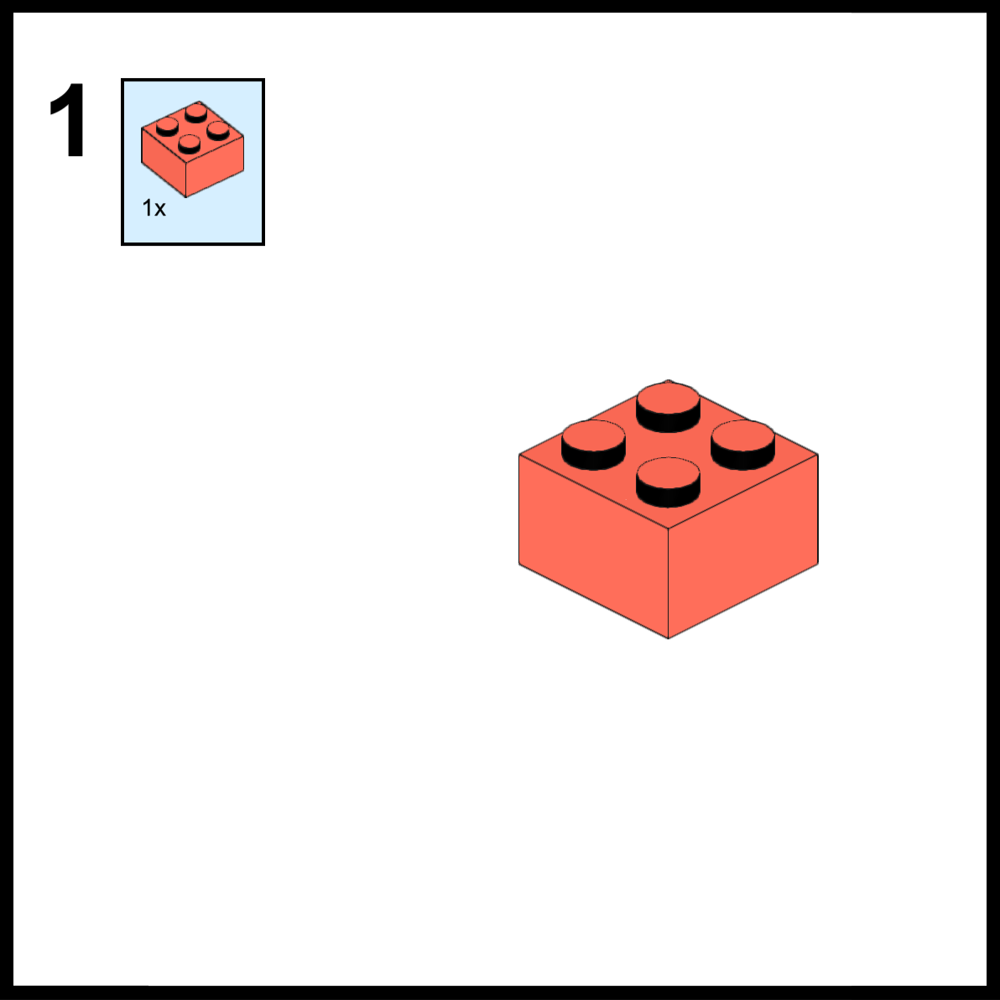
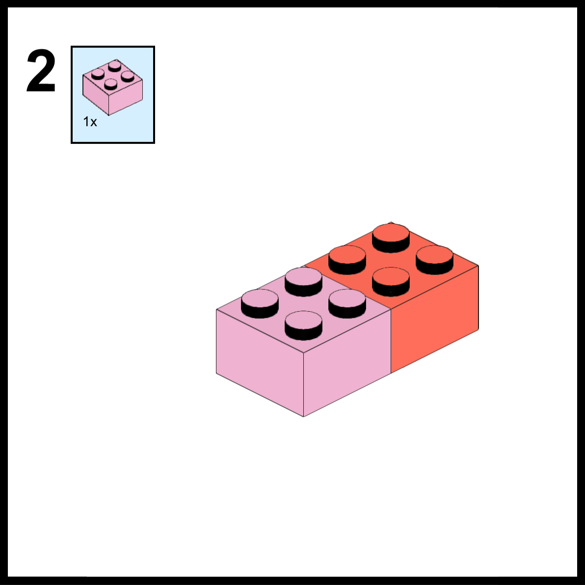
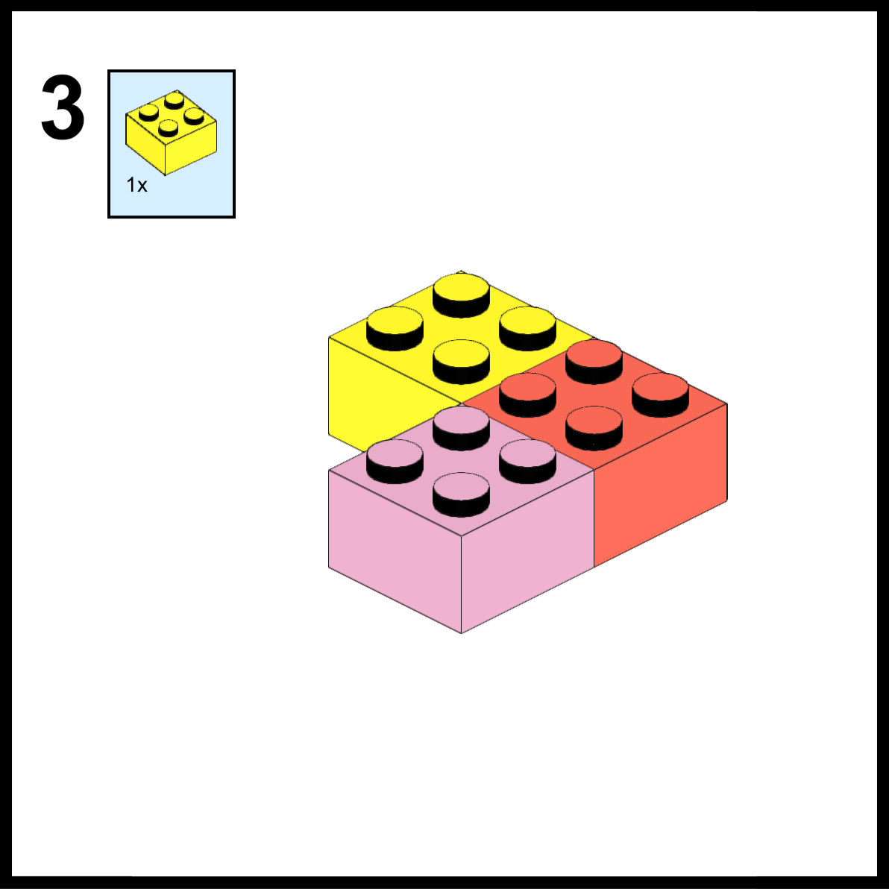

# Bricks <small>2.1</small>

> Bricks is a valuable plugin for developers seeking to create custom blocks for the Gutenberg editor in WordPress using Advanced Custom Fields Pro.

With Bricks, developers can efficiently build blocks that are both reusable and well-structured.

This enhances the management and maintenance of the blocks while delivering an exceptional user experience.

The integrated registration method enables the inclusion of CSS, JavaScript, and SCSS, and the comprehensive set of block JSON features allows for extension of blocks without additional coding.

Whether creating complex blocks with ACF fields or constructing fast-performing blocks without the need for compiling, Bricks provides the necessary tools for creating professional and high-quality blocks that are both functional and visually appealing

# Key Features

- **Developer-friendly**: Bricks is designed with the needs of developers in mind, providing a simple and intuitive interface for building custom blocks for the Gutenberg editor.
- **No React knowledge required**: Bricks does not require any knowledge of React, making it accessible to a wide range of developers.
- **Customizable**: Bricks offers a high degree of customization, allowing you to create blocks that perfectly match your needs.
- **User restrictions**: Bricks includes user restrictions, allowing you to control who can access and use your blocks.
- **Vue@2 and Vue@3 support**: Bricks supports both Vue@2 and Vue@3, giving you the flexibility to choose the version that best fits your needs.
- **Works natively (limited)**: Bricks has native support, with some limitations, making it easy to use and integrate with your existing projects.
- **Easy to set up**: Bricks is easy to set up, with a straightforward installation process that gets you up and running in no time.
- **Reusable blocks**: Bricks enables the creation of reusable blocks, making it easier to manage and maintain your custom blocks.
- **Auto-enqueuing files**: Bricks includes an auto-enqueuing feature, ensuring that your blocks are properly loaded and accessible.
- **SVG support**: Bricks supports SVG, allowing you to use scalable vector graphics in your custom blocks.
- **Category support**: Bricks includes category support, allowing you to categorize your blocks for easier organization and management.
- **Styles support**: Bricks supports styles, giving you the ability to customize the look and feel of your blocks.
- **All Gutenberg WordPress support types**: Bricks supports all types of WordPress Gutenberg blocks, making it a versatile and comprehensive solution for block creation.

# Links

[ACF Blocks](https://www.advancedcustomfields.com/resources/blocks/)  
[Wordpress Blocks](https://wordpress.com/support/wordpress-editor/blocks/)
[GitHub Bricks](https://github.com/mitchell-b-chelin/Bricks)

Bricks leverages the power of [Advanced Custom Fields Pro](https://www.advancedcustomfields.com/pro/) to simplify the process of registering custom blocks in the WordPress Gutenberg editor. By incorporating ACF fields, Bricks provides developers with a comprehensive solution for creating custom blocks that are both functional and visually appealing.

# Setup

To start using Bricks in your WordPress instance, create a new folder named "templates" in your theme's directory, and within that folder, create another folder named "bricks" at the following location: `themesdir/templates/bricks/` This folder will serve as the home for all your custom Gutenberg blocks.

The plugin directory includes an "example" folder, which contains a readme file and a sample setup for categories and blocks. You can use these as a reference or follow the provided documentation.

!> Please note that the base directory naming can be changed later on through the [Overides](wpd_overides.md#admin-menu) features.

