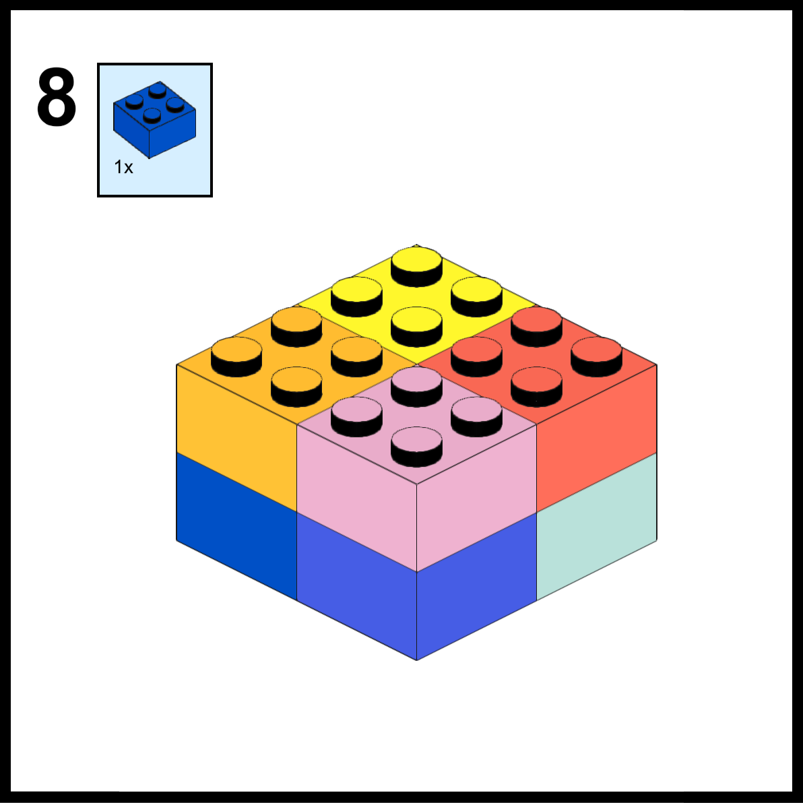

# Overides

Bricks provides a way to change the default directory, loaded assets, and other properties within Bricks. 

To achieve this, you can use the following code in your `functions.php` file
```php
/* functions.php */

/* Is not required rename the namespace using MBC\inc before the class is fine */
use MBC\brick as BRICKS;

BRICKS\Prepare::setup(array(
    //Template path for where your bricks are stored.
    'template_path' => get_stylesheet_directory() . '/templates/blocks/',
    // Template restriction php
    'template_restriction' => get_stylesheet_directory() . '/templates/core/block_restricted.php',
    // Vue version and enviroment loaded
    'vue' => array(
        'version' => '3',
        'enviroment' => 'development'
    ),
    // block globals loaded each instance of a block
    'global' => array(
        // Javascript globals
        'javascript' => array(
            get_stylesheet_directory_uri() . '/assets/js/script1.js',
            get_stylesheet_directory_uri() . '/assets/js/script2.js',
        ),
        // Stylesheet globals
        'css' => array(
            get_stylesheet_directory_uri() . '/assets/css/style1.css',
            get_stylesheet_directory_uri() . '/assets/css/style2.css',
        ),
        // Sass Globals ( if you are using SCSS-Native Plugin otherwise a empty array is required )
        'scss' => array(
            'mixins' => array(
                get_stylesheet_directory_uri() . '/assets/scss/mixins/mixin1.scss',
                get_stylesheet_directory_uri() . '/assets/scss/mixins/mixin2.scss',
            ),
            'stylesheets' => array(
                get_stylesheet_directory_uri() . '/assets/scss/style1.scss',
                get_stylesheet_directory_uri() . '/assets/scss/style2.scss',
            )
        )
    )
));
```